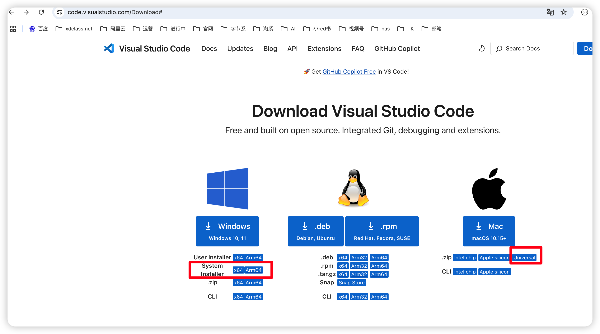
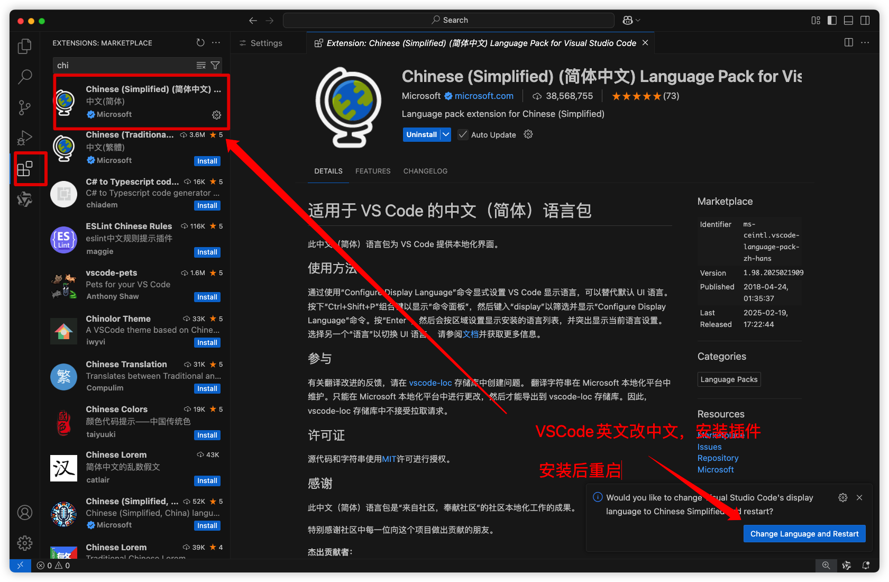
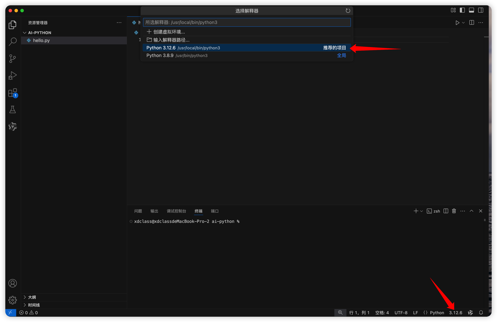

### 第一章 AI大模型版-Python零基础极速上手实战


#### 第1集 Python语言的前世今生和版本-编辑器说明

**简介：  Python语言的前世今生和版本-编辑器说明**

* Python语言

  * Python是一种**简单易学**、**功能强大**的高层次编程语言，被称为"胶水语言"（能轻松整合其他语言组件）

  * 网站地址 : https://www.python.org/

  * 核心特点

    * **极简语法**  示例：用一行代码打印"Hello World"

      ```
      print("Hello World!")
      ```

      * 对比：相同功能在Java需要5行代码，C++需要7行代码

    * **动态类型** ：变量类型自动判断（无需声明类型）

      ```
      age = 25           # 自动识别为整数
      name = "张三"      # 自动识别为字符串
      ```

    * **解释型语言**： 无需编译，直接运行（对比C++需要先编译成二进制文件）

    * **丰富的生态库**：AI开发常用库：NumPy（科学计算）、Pandas（数据处理）、PyTorch（深度学习）

  * 应用领域

    * Web后端开发（框架**Django**、**Flask**, LangChain,LangGraph）、爬虫、数据分析、自动化办公、人工智能、机器学习、AI大模型开发

    |    领域    |       典型库        |       应用场景        |
    | :--------: | :-----------------: | :-------------------: |
    |  人工智能  | TensorFlow, PyTorch | 图像识别/自然语言处理 |
    |  数据分析  | Pandas, Matplotlib  |  销售数据可视化分析   |
    | 自动化运维 |  Ansible, Paramiko  |    服务器批量管理     |
    |  Web开发   |    Django, Flask    |    企业级网站开发     |

* 语言版本（请注意，Python 2.x 系列已经在 2020 年停止支持，建议使用 Python 3.x 系列的版本）

  |   版本号    |  发布时间  |                   主要特性/改进                   | 是否推荐使用 |
  | :---------: | :--------: | :-----------------------------------------------: | :----------: |
  | Python 2.7  | 2010年7月  |       最后一个Python 2系列版本，长期维护版        |   ❌ 已淘汰   |
  | Python 3.0  | 2008年12月 | 引入不兼容2.x的语法（print函数、Unicode字符串等） |  ❌ 历史版本  |
  | Python 3.7  | 2018年6月  |  数据类(dataclass)、异步生成器、内置breakpoint()  |  ⚠️ 过渡版本  |
  | Python 3.8  | 2019年10月 |         海象运算符(:=)、位置参数限定符(/)         |    ✅ 稳定    |
  | Python 3.9  | 2020年10月 |      字典合并运算符)、字符串前缀后缀移除方法      |  ⚠️ 过渡版本  |
  | Python 3.10 | 2021年10月 |   结构化模式匹配(match-case)、更友好的错误提示    |  ✅ 推荐首选  |
  | Python 3.11 | 2022年10月 |     性能提升60%、异常添加备注、TOML标准库支持     |   ✅ 高性能   |
  | Python 3.12 | 2023年10月 |  更快的解释器、改进的错误信息、移除distutils模块  |    ✅ 最新    |

  * 推荐版本：

    - 新手学习和正式使用：Python 3.10以上（LTS版本长期支持，文档完善，稳定性和性能平衡）
    - 有3.10以上版本的大体语法类似，所以小版本有差异不影响
    - 文档地址：https://docs.python.org/zh-cn/3.10/

  * 查看当前电脑是否有安装

    ```
    # 查看当前Python版本
    python --version
    ```

* 常用编辑器

  |     工具名称     |  类型  |     适合场景      | 学习曲线 |            核心优势            |                          下载地址                           |
  | :--------------: | :----: | :---------------: | :------: | :----------------------------: | :---------------------------------------------------------: |
  |    **VSCode**    | 编辑器 | 全栈开发/通用编程 |   中等   |     轻量快速、插件生态丰富     |   [code.visualstudio.com](https://code.visualstudio.com/)   |
  |   **PyCharm**    |  IDE   | 大型项目/专业开发 |   较高   |   智能代码补全、深度框架支持   | [jetbrains.com/pycharm](https://www.jetbrains.com/pycharm/) |
  |   **Jupyter**    | 笔记本 | 数据分析/算法实验 |    低    | 交互式编程、可视化结果即时呈现 |             [jupyter.org](https://jupyter.org/)             |
  |    **Spyder**    |  IDE   | 科学计算/数值分析 |    低    | 内置变量查看器、MATLAB风格界面 |        [spyder-ide.org](https://www.spyder-ide.org/)        |
  | **Sublime Text** | 编辑器 | 快速编辑/轻量开发 |   中低   |      启动极快、多光标编辑      |       [sublimetext.com](https://www.sublimetext.com/)       |

  


#### 第2集 Python环境安装和编辑器安装实战

**简介：  Python环境安装和编辑器安装实战**

* Python配置环境变量

  * 根据情况选择不同系统的安装包，记得选择installer（win）为主，方便使用
  * 自己去官网下载（结合网上的博文搜索下安装和升级方式）
  * 地址：https://www.python.org/

  

* 编辑器 **Visual Studio Code（AI开发首选）**

  * 根据自己的系统情况自己去官网下载
  * 地址：https://code.visualstudio.com/Download
  * 使用地址 https://code.visualstudio.com/docs/python/python-quick-start

  

  * 推荐插件组合

    ```
    Python 微软官方支持
    Pylance 类型提示增强
    Python Snippets 编码技巧
    Python Indent 缩进
    TONGYI Lingma AI编码
    ```

  * 编辑器英文改中文

    


#### 第3集 Python标识符-缩进-注释-常见错误

**简介： Python标识符-缩进-注释-常见错误**

* 运行第一行代码（右下角选择Python解释器版本）

  ```
  # 经典入门程序
  print("Hello World!")  # 打印输出
  print(2 + 3 * 4)       # 数学运算
  ```



* 标识符规则（变量/函数/类命名）

  * 合法命名规范

    ```
    # 正确示例
    age = 18              # 纯字母
    student_name = "小明"  # 含下划线
    _price = 9.9          # 以下划线开头
    MAX_COUNT = 100       # 全大写常量（约定俗成）
    ```

  * 非法命名示例

    ```
    2name = "错误"        # ❌ 数字开头
    class = "计算机"      # ❌ 使用保留字
    first-name = "张"     # ❌ 含连字符
    ```

  * 命名规范建议

    | 类型 |  推荐格式  |     示例      |
    | :--: | :--------: | :-----------: |
    | 变量 | 小写下划线 | `student_age` |
    | 常量 |   全大写   |  `MAX_VALUE`  |
    | 函数 | 小写下划线 | `get_data()`  |
    | 类名 |   大驼峰   | `DataParser`  |

* 注释规范

  * 单行注释

    ```
    # 计算圆的面积（解释代码作用）
    radius = 5
    area = 3.14 * radius ** 2  # 公式 πr²
    ```

  * 多行注释

    ```
    """
    作者：张三
    日期：2030-10-01
    功能：计算BMI指数
    参数说明：
      weight: 体重(kg)
      height: 身高(m)
    """
    def calc_bmi(weight, height):
        return weight / (height ** 2)
    ```

  * 注释最佳实践

    * 解释为什么这么做，而不是描述代码本身
    * 关键算法添加注释
    * 修改代码时同步更新注释

* 保留字（关键字）

  * Python 3.12全部保留字（35个）

  ```
  # 查看当前版本关键字
  import keyword
  print(keyword.kwlist)
  
  '''
  ['False', 'None', 'True', 'and', 'as', 'assert', 'async', 
   'await', 'break', 'class', 'continue', 'def', 'del', 
   'elif', 'else', 'except', 'finally', 'for', 'from', 
   'global', 'if', 'import', 'in', 'is', 'lambda', 
   'nonlocal', 'not', 'or', 'pass', 'raise', 'return', 
   'try', 'while', 'with', 'yield']
  '''
  ```

* 行与缩进

  ```
  # 正确缩进示例
  if 10 > 5:
      print("条件成立")  # 缩进4个空格
      print("继续执行")  # 同一代码块保持相同缩进
  else:
      print("不成立")
  ```

* 新手常见错误

  * 缩进错误

  ```
  # 错误示例
  def greet():
  print("Hello")  # ❌ 缺少缩进
  
  # 正确写法
  def greet():
      print("Hello")
  ```

  * 混用空格和Tab

  ```
  # 文件统一使用4个空格缩进
  # 在编辑器中设置：空格替代Tab
  ```

  * 错误使用保留字

  ```
  # 错误示例
  class = "计算机科学"  # ❌ class是关键字
  
  # 正确写法
  class_name = "计算机科学"
  ```

  


#### 第4集 Python输出高级技巧和f-string字符串语法

**简介： Python输出高级技巧和f-string字符串语法**

* print输出

  * 基本语法

  ```
  print(value1, value2, ..., sep=' ', end='\n', file=sys.stdout, flush=False)
  ```

  - 参数说明
    - `values`：要输出的值，可以是多个，用逗号分隔。
    - `sep`：分隔符，默认是空格。
    - `end`：结束符，默认是换行符`\n`。
    - `file`：输出目标（如文件对象），默认是控制台。
    - `flush`：是否强制刷新输出（默认False）。

  * 默认输出是换行的，如果要实现不换行需要在变量末尾加上 **end=" "**：

  ```
  # 输出多个值
  print("Hello", "Python", 2030)  # Hello Python 2023
  
  # 修改分隔符和结束符
  print("张三", "李四", sep="---", end="!!!")  # Hello---Python!!!
  ```

* 格式化输出

  * 支持格式化字符串的输出 ，支持复杂的表达式

  * **str.format()**（推荐）：

    ```
    print("Name: {}, Age: {}".format(name, age))  # 按顺序填充
    print("Name: {name}, Age: {age}".format(name="老王", age=30))  # 按关键字填充
    ```

  * **f-string**（Python 3.6+，最简洁）字面量格式化字符串

    * f-string 格式化字符串以 f 开头，后跟着字符串，字符串中的表达式用大括号 {} 包起来，会将变量或表达式计算后的值替换
    * 之前习惯用百分号 (%)，现在更简单，不用再去判断使用 %s，还是 %d

    ```
    name = "小明"
    age = 18
    print(f"姓名：{name}，年龄：{age}")  # 姓名：小明，年龄：18
    ```

    * 支持任意合法的Python表达式：

    ```
    # 数学运算
    print(f"结果：{3 * 4 + 5}")  # 结果：17
    
    # 三目运算符
    score = 85
    print(f"等级：{'优秀' if score >=90 else '良好'}")
    ```

  * 常见错误

    ```
    # 错误示例1：忘记f前缀
    name = "韩梅梅"
    print("姓名：{name}")  # 不会报错，但输出原样文本
    
    # 错误示例2：无效表达式
    print(f"结果：{len('abc')}")  # 正确写法
    print(f"结果：{len 'abc'}")    # 语法错误（缺少括号）
    ```

    

* 注意事项

  * 默认换行符是`\n`，可以通过`end=""`取消换行。
  * `f-string`中不能使用反斜杠转义字符（如`\n`），需用变量代替
  * 速度对比

  ```
  # 速度测试对比（1,000,000次）：
  # f-string: 0.12秒
  # format方法: 0.25秒
  # %格式化: 0.18秒
  ```

  


#### 第5集 Python用户输入和模块导入模块讲解

**简介： Python用户输入和模块导入模块讲解**

* 用户输入

  * 使用input()函数获取用户输入，**返回值**：输入内容始终是字符串类型。

  * 基本语法

    ```
    user_input = input("提示信息：")
    ```

  * 案例代码

    ```
    # 基本输入
    name = input("请输入姓名：")
    print(f"你好，{name}！")
    
    # 类型转换
    age = int(input("请输入年龄："))
    print(f"你明年将 {age + 1} 岁。")
    
    # 多输入处理（通过split分割）
    values = input("输入两个数字（空格分隔）：").split()
    # map(func,lst) 讲传入的函数变量func作用在lst上每个元素中
    a, b = map(int, values)
    print(f"两数之和：{a + b}")
    ```

    

* import语句

  * 在 python 用 import 或者 from...import 来导入相应的模块。

  |     特性     |  import module   | from module import obj |
  | :----------: | :--------------: | :--------------------: |
  |   命名空间   |     保持完整     |   直接引入当前作用域   |
  |   内存占用   |       较大       |          较小          |
  |  代码可读性  |     明确来源     |    可能造成命名混淆    |
  |   修改影响   |  需修改全称引用  |  本地修改不影响原模块  |
  | 典型应用场景 | 频繁使用多个对象 |    少量高频使用对象    |

  * 导入整个模块

    ```
    import math
    print(math.sqrt(16))  # 4.0
    ```

  * 导入特定功能

    ```
    from math import sqrt, pi
    print(sqrt(16))  # 4.0
    print(pi)        # 3.141592653589793
    ```

  * 相对导入（包内使用）

    ```
    # 在 mypackage/sub/mod.py 中
    from .. import utils  # 上级目录导入
    from . import helper  # 同级目录导入
    ```

  * 最佳实践指南

    * **优先顺序原则**：

      - 标准库模块 → 第三方库 → 自定义模块
      - 绝对导入优先于相对导入

      ```
      # 推荐
      import numpy as np
      from django.db import models
      
      # 避免
      from module import *
      ```

  * 案例作业

    ```
    # 导入自定义模块
    # 假设存在一个 my_module.py，内容为：def greet(): print("Hello!")
    import my_module
    my_module.greet()  # Hello!
    ```

    

    


#### 第6集 Python的变量和常见数据类型讲解

**简介： Python的变量和常见数据类型讲解**

* 变量

  * Python 中的变量不需要声明，每个变量在使用前都必须赋值，变量赋值以后该变量才会被创建。
  * 动态类型, 变量类型由赋值决定, 变量就是变量，没有类型

  ```
  a = 10      # int
  a = "Hello" # 类型动态改变（实际是绑定到新对象）
  ```

  * 命名规范

  |  规则类型  |      正确示例       |        错误示例         |
  | :--------: | :-----------------: | :---------------------: |
  |  合法字符  | `var_1`, `中文变量` |   `2var`, `var-name`    |
  | 大小写敏感 |     `age ≠ Age`     |            -            |
  | 保留字规避 |  `list_ = [1,2,3]`  |    `list = [1,2,3]`     |
  |  PEP8推荐  |     `user_name`     | `userName` (PascalCase) |

  * 拓展：PEP8 指  Python Enhancement Proposal（Python增强提案）的第8号提案

* 数据类型概览

  * Python中一切皆对象，常见基本数据类型  (**内置的 type() 函数可以用来查询变量的对象类型**)

  * 数据容器（序列）是一种可以存储多个元素的Python数据类型，包含：**list(列表)、tuple(元组)、str(字符串)、set(集合)、dict(字典)**

    ```
    1. 数字类型（Numbers）
       - 整数（int）
       - 浮点数（float）
       - 布尔（bool，是int的子类）
    
    2. 序列类型（Sequences）
       - 字符串（str）
       - 列表（list）
       - 元组（tuple）
    
    3. 映射类型（Mapping）
       - 字典（dict）
    
    4. 集合类型（Sets）
       - 集合（set）
       - 不可变集合（frozenset）
    
    5. 其他
       - None（空类型）
    ```

  * 类型分类

    | 可变类型 |    不可变类型    |
    | :------: | :--------------: |
    |   list   | int, float, bool |
    |   dict   |       str        |
    |   set    |      tuple       |

  * 数据类型速查表

    | 类型  | 可变 | 有序 |  重复  |    语法示例     |
    | :---: | :--: | :--: | :----: | :-------------: |
    |  int  |  ×   |  -   |   -    |    `a = 10`     |
    | float |  ×   |  -   |   -    |   `b = 3.14`    |
    |  str  |  ×   |  √   |   √    |  `s = "hello"`  |
    | list  |  √   |  √   |   √    | `lst = [1,2,3]` |
    | tuple |  ×   |  √   |   √    |  `tpl = (1,2)`  |
    | dict  |  √   |  ×   | 键唯一 |  `d = {'a':1}`  |
    |  set  |  √   |  ×   |   ×    |  `s = {1,2,3}`  |

* 数字类型（Numbers）

  * 整数（int）

    * 特点：无大小限制，支持二进制（0b1010）、八进制（0o12）、十六进制（0x1A）
    * 案例：

    ```
    a = 10          # 十进制
    b = 0b1010      # 二进制 → 10
    c = 1_000_000   # 分隔符增强可读性（Python3.6+）
    
    print(a, b, c)
    ```

  * 浮点数（float）

    * 特点：带小数点的数，可用科学计数法（2.5e3 = 2500.0）
    * **案例**：

    ```
    x = 3.14
    y = 2.5e-3      # 0.0025
    ```

  * 布尔（bool）

    * 取值：True（1） / False（0）
    * 案例

    ```
    is_active = True
    print(int(is_active))  # 1
    ```

    

